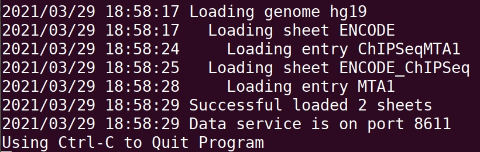
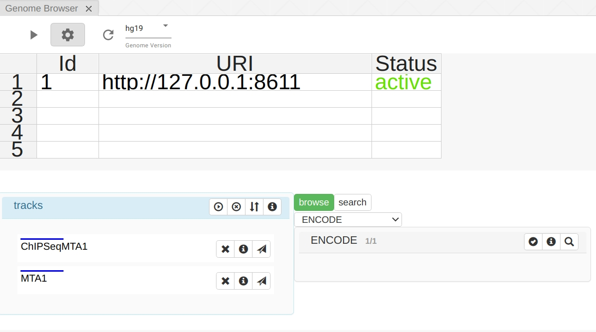
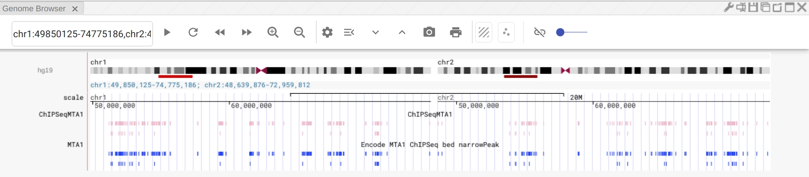
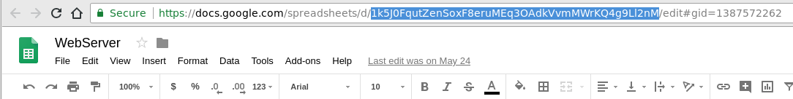
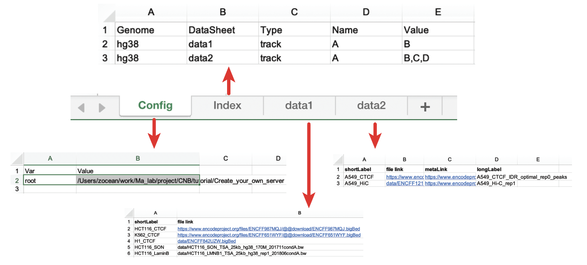
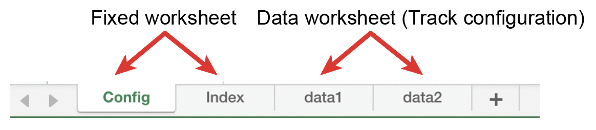
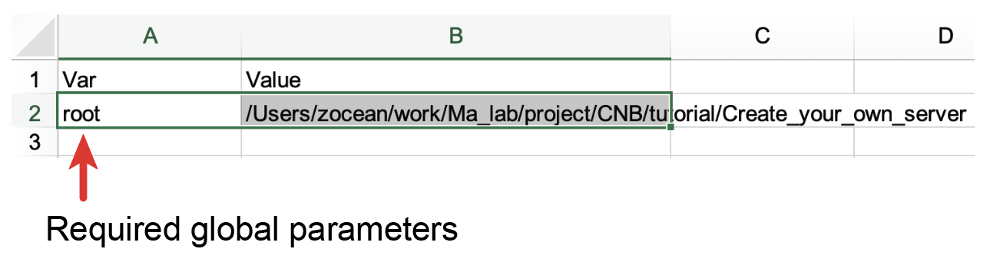
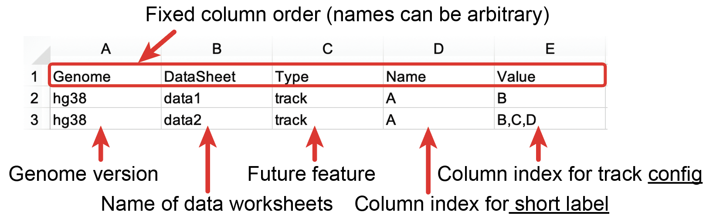
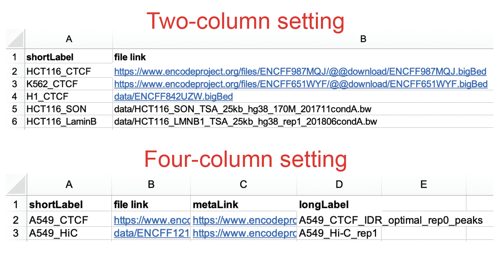

# NucleServer

[](https://travis-ci.org/nucleome/nucleserver)
[](https://github.com/nucleome/nucleserver/releases)
[](https://goreportcard.com/report/github.com/nucleome/nucleserver)
[](https://opensource.org/licenses/GPL-3.0)
[](https://github.com/nucleome/nucleserver)

[_NucleServer_](http://doc.nucleome.org/data/server) is a standalone tool to host a data service for [_Nucleome Browser_](https://vis.nucleome.org). You can use this tool to host either genomic data or 3D structural modeling data on a personal computer or a data server. For genomic data, it supports common data types such as genome tracks in format of [bigWig](https://genome.ucsc.edu/goldenpath/help/bigWig.html), [bigBed](https://genome.ucsc.edu/goldenpath/help/bigBed.html), [.hic](https://github.com/aidenlab/Juicebox/blob/master/HiC_format_v8.docx), or [tabix](https://www.ncbi.nlm.nih.gov/pmc/articles/PMC3042176/). For 3D structural modeling data, it supports a customized [Nucle3D](https://github.com/nucleome/nucle3d) format. Read the [documentation](https://nb-docs.readthedocs.io/en/latest/data_service.html) for more examples.

## Quick Start

Below is a quick demo showing you how to set up a genomic data service with sample data.

First, you need to download the pre-compiled executable files from [the latest release](https://github.com/nucleome/nucleserver/releases) in this GitHub repository.
We provide pre-compiled files in Linux, Windows, and Mac OS.
You can directly download the pre-compiled program based on your operating system.
If the program is not compatible with your machine, you can also try to compile it by cloning this repository.

> TIP: If you are using Windows and not familiar with running a command-line tool in Windows, please refer to [this article](https://www.computerhope.com/issues/chusedos.htm). If everything goes well, you should be able to run `nucleserver` as a command-line tool in the terminal.

> TIP: Please also note that you need to grant the correct permission to the program. In Linux/Mac, this can be done with the command `chmod +x nucleserver`.

Second, you need to prepare an excel file for configuration.
For this quick demo, we have prepared this [demo file](https://docs.google.com/spreadsheets/d/1nJwOozr4EL4gnx37hzF2Jmv-HPsgFMA9jN-lbUj1GvM/edit#gid=1744383077).
You can download the Google Sheet and save it as an Excel file (let's name in nucle.xlsx from now on).
We also provided this file (nucle.xlsx) in this repo.
This Excel file contains several datasheets, such as configuration, data sheets pointing to several bigBed files host remotely by ENCODE on the Internet.
Nucleserver can host not only data stored on the web but also data that existed in local computers.
The only important step is to provide the right uniform resource identifier (URI) of data so that the nucleserver can successfully get the data (see below).

Finally, you can start the data server using the following command:

```
nucleserver start -i nucle.xlsx
```

You should see messages showing you that datasheet has been added to a local data server (see the figure below).



The URL of the data server in this case (i.e., local machine with a default 8611 port) is:

```
http://127.0.0.1:8611
```

> TIP: Please note that you don't have to add this particular URL (http://127.0.0.1:8611) to Nucelome Browser. This localhost URL is one of the default servers in Nucleome Browser. If you start a data server under this URL, you can just reload server content or add a new genome browser panel after the local server starts. Your custom data will automatically show up in this genome browser config panel. If the data server URL is different from the URL mentioned above, you would have to add it manually to [Nucleome Browser](https://vis.nucleome.org). Please see [the document](https://nb-docs.readthedocs.io/en/latest/data_service.html#genomic-data) for details.



> TIP: If you do not know how to add a new genome browser panel, you can watch animation [here](https://nb-docs.readthedocs.io/en/latest/animation.html#panel-oraganization). Basically, in [Nucleome Browser](https://vis.nucleome.org), there is a **plus** button on the top menu bar. You can click it and select the genome browser panel. In a genome browser panel, you can then config data service using the configuration interface.


You should see two ChIP-seq tracks showing peaks in the genome browser as shown below:



## Install by compiling source code

If the binary is not working for you or you want to install the latest experimental version, you can also compile from the source code.
NucleServer is implemented in [GoLang](https://golang.org) ( version > 1.11 ) and hosted on Github.
With the Golang environment installed, the source code can be cloned simply by the following command.

```
go get -u github.com/nucleome/nucleserver
```

## Start a data service using a Google Sheet

You can also use Google Sheet as the configuration file by replacing the path to a local Excel file with a Google Sheet ID.

In Mac OS or Linux, use the following command to start a data service.

```shell
./nucleserver start -i [google sheet id or excel file] -p [port default:8611]
```

In Windows, use the following command to start a data service.

```shell
nucleserver.exe start -i [google sheet id or excel file] -p [port default:8611]
```

> TIP: The **Google Sheet ID** can be found as part of the URL in the Google Sheets webpage. It is shown with a blue background in the following screenshot.

.

> TIP: If this is the **first time** you run `nucleserver` with a google sheet, the program will ask you to provide authorization to view files on your Google Drive. First, you need to copy the web link shown in the terminal and open this link in a web browser. It will ask you to grant the permissions. After you give the permission, Google should provide you a token. Please paste this token into the terminal, hit enter, and finish the authorization step. After the authorization step is done, a credential token will be stored in `[Your Home Dir]/.nucle/credentials/gsheet.json`.

## Configuration file

As forementioned, a config file can either be an Excel file or a Google Sheets.
In this section, we will explain how to create your configuration file.
You can start with the demo excel file provided in the Quick Start section.



The configuration file must contain two sheets, namely **\*Config** and **Index**. The rest worksheets contain the details of the source of data and configuration.



- The **Config sheet** contains global parameters. The first row of the Config worksheet is the header and should be named as **Var** and **Value**, respectively. Currently, the root parameter under the column of Var is the only parameter required for NucleServer. This root parameter stores the root path for all genomic data files that are stored on the local computer. The purpose of this parameter is to help users conveniently migrate data between computers. For example, if all the files are stored in a folder under the path (/home/tom/project/genomic-data/), you can set the value of root in the column of Value as /home/john/project/genomic-data/. Later, when you fill in the worksheet of data, you can just put the filename of a data in the file link column (see below) and NucleServer and NucleData will know where to look for these files. Some of the data may be stored in the cloud. In that case, you can just put the URLs of data in the worksheet of data. NucleServer and NucleData assume that file links of data that do not start with **http or https** are all stored locally on your computer.
  
- The **Index sheet** contains the info of all the Data Sheets. The meaning of each column is shown below. The first row of the Index sheet is the header. Other rows indicate data worksheets. The 1st column is the genome assembly of data. Nucleome Browser supports all the reference assembly provided by the UCSC genome browser. The genome assembly name should be in lowercase letters and all data in that data worksheet should from the same genome assembly. The 2nd column is the name of a specific data worksheet. The 3rd column is set for future features and is currently not used (you can put ‘track’ here). The 4th and 5th columns indicate which columns in that data worksheet represent short labels of tracks and data URI, respectively.
  .
- **Data sheet**: The 4th and 5th columns of the Index sheet tell the nucleserver where to get the data and how to render them in the browser. There are two ways to configure this sheet: two-column format or four-column format. In both settings, the 4th column (the Name column in the figure) indicates the short label of a data track. The difference between the two settings is the 5th column of the Index sheet. In the two-column setting, the fifth column refers to the column-index of the file path (or URL) in the data worksheets (see the figure below). In the four-column setting, the fifth column refers to the column-index of the file path (or URL), URL of meta-information, and long label. Note that in the four-column setting, the order of the column-index must be the **file path**, **URL of meta-information**, and **long label**. The number or the order of columns in the datasheet can be arbitrary for each datasheet. Just make sure the order of column-index matches the expected order. For example, you can put file path in column G, URL of meta-information in column B, and long label in column A. Then you should put G, B, A in the 5th column of the Index sheet.
  

> TIP: If you have a lot of tracks, you should try to create the excel file using the program. For example, you can use pandas python to create an Excel file with multiple datasheets.

> TIP: **file path** can point to a local file or a URL as shown in the Quick Start section. If it is a URL, the nucleserver will download the index and store it in "$HOME/.nucle/index". When users navigate along the genome, the nucleserver will fetch the data based on the index.

> TIP: **URL of meta-information** can a web link so that this website will open when a user clicks the long label of track on the genome browser. If there is no external website for tracks, you can just put anything here.

## Other hints

### Create an excel file using python

If there are a lot of datasheets, it may be wise to create an excel file using scripts. You can use the Python package pandas to add data frames into an excel file. For example, you can prepare separate files for each sheet in the excel file. You can then use the following script to add them to an excel file

```
import pandas as pd
writer = pd.ExcelWriter(data_server.xlsx)
# add config sheet
config = pd.read_csv(config_file, sep = '\t', header = 0)
config.to_excel(writer, sheet_name = 'Config', index = False)
# add index sheet
index = pd.read_csv(config_file, sep = '\t', header = 0)
index.to_excel(writer, sheet_name = 'Index', index = False)
# add data sheet
data = pd.read_csv(sheet_file, sep = '\t', header = 0)
data.to_excel(writer, sheet_name = 'Hi-C_data', index = False)
# add more data sheet
writer.save()
```

### Put a data service in the background.

You may want to put a data service in the background so that the data service remains running after the terminal is closed. There are many ways to keep processes running in the background. For example, you can use nohup as shown below.

```
nohup nucleserver start -i [nucle.xlsx] &
```

We also recommend [tmux](https://github.com/tmux/tmux), which has more features to manage background processes.

### Re-start data service after a crash

If you want to re-start the data service after it crashes you can use the following code. The start.sh is the script you want to re-start after it crashes (in our case, it would be nucleserver start ...)

```
cnt=0
max=5

until ./start.sh; do
    let cnt=cnt+1
    echo "Server 'myserver' crashed with exit code $?.  Respawning.." >&2
    sleep 3
    [ $cnt = $max ] && exit;
done
```

### Max number of tracks

If you have a large number of data (tracks), it may exceed the maximum number of open files allowed in your operating system. In Linux, you can check the limit and increase the soft limit using the ulimit command.

```
# check the hard limit in linux
ulimit -Hn
1048576
# check the soft limit in Linux
ulimit -Sn
1024
# increase soft limits
ulimit -n 5000
ulimit -Sn
5000
```

### Update nucleserver

The easiest way to upgrade the nucleserver is to the update command.

```
# update nucleserver to the latest versiono
./nucleserver update
```

### Host private and public data for the community in "HTTPS"

We highly recommend the host servers to support "HTTPS", as it promotes the browser's functionality in a progressive web application, google based permission management, and session storage. If the data is sensitive, you can also host it locally. It is then not accessible by other users or web application administrators. We also provide a simple password protection option (currently experimental) for user access to data on the internet. As demonstrated below, the user can add a password when starting the server.

```
nucleserver start -i [nucle.xlsx] -c password
```

As a result, only users who login with the password through the following webpage can access the hosted data.

```
http://yourwebsite:8611/main.html
```

### Host your data in servers without https

To host your data in servers without SSL certification, you can use **http://vis.nucleome.org** which supports fetch data from non-SSL websites.
Alternatively, you can make a tunnel between your server with localhost using the command below.

```
ssh -N -L 8611:localhost:8611 server
```

### Converting local data server to the public using reverse Proxy

A Reverse Proxy implemented in GoLang [Traefik](https://traefik.io/) is recommended for convert local data services to an HTTPS global data service. [Nginx](https://www.nginx.com/) is also working here.

### Using Reverse Proxy to host more data services in the same domain

Nucleome Browser default data services are "/d/portal" (4DN public data on 4DN DCICI) and "https://127.0.0.1:8611".
Nucleome Browser supports URL like "https://[youdomain]/path/to/dataservice".

### Build an Entry to A Nucleome Browser with customized data services.

The easiest way is to configure your panel and save it as a session to your Google Sheet.
Copy the saved session to a Google Sheet with a shareable view link.
The entry will be on the following link.

```
https://vis.nucleome.org/entry/?sheetid=[your public google sheet id]&title=[Sheet1]
```

# Depedencies

- fetch data from bigwig and bigBed files https://github.com/pbenner/gonetics
- fetch data from tabix files github.com/brentp/bix
